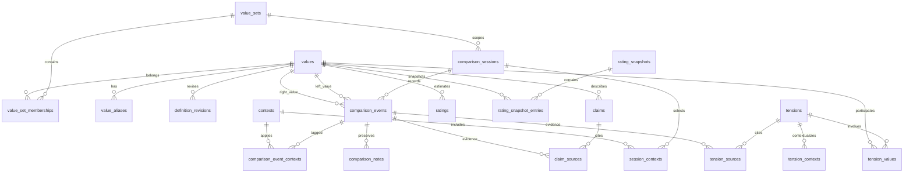

# Values Tool

Values Tool is a local-first analytical application for ranking personal values through adaptive pairwise and five-value questions. Rapid sessions rank five values at once; an optional finite pairwise scheduler remains available for exact ordering. A TrueSkill-style Bayesian model retains uncertainty, tiers, and context dependence. Every decision can preserve the user's original reasoning as evidence.

The application has two delivery adapters:

- **GitHub Pages / static:** React + SQLite WASM (`sql.js`) + Drizzle, persisted as database bytes in IndexedDB. This is the canonical hosted experience and needs no server.
- **Local Node:** Next.js App Router + `better-sqlite3` + Drizzle. This provides server actions and a file-backed `data/values.db`.

Both adapters share the schema, rating engine, convergence diagnostics, tension detection, imports, and tests. No authentication, secrets, cloud database, or external API is required.

## Quick Start

Requirements: Node.js 22 or newer and npm.

```bash
npm install
npm run dev:pages
```

Open `http://localhost:5173`. The browser app is closest to the GitHub Pages deployment.

For the file-backed Next.js adapter:

```bash
npm run db:migrate
npm run dev
```

Open `http://localhost:3000`.

Development seed data is deliberately separate from normal application data:

```bash
DATABASE_URL=./data/development.db npm run db:seed
DATABASE_URL=./data/development.db npm run dev
```

The seed command refuses to add demonstration records to a database that already contains a value set.

## Commands

```bash
npm run dev             # Next.js local server
npm run dev:pages       # Static browser/Pages application
npm run db:migrate      # Apply Drizzle migrations
npm run db:generate     # Generate a migration after schema changes
npm run db:seed         # Add development-only demonstration data
npm run lint            # ESLint
npm run typecheck       # Strict TypeScript
npm test                # Vitest unit and integration tests
npm run test:e2e        # Playwright desktop and mobile journeys
npm run build           # Next.js production build
npm run build:pages     # Static GitHub Pages build in out/
npm start               # Run a completed Next.js build
```

Install Playwright's browser once before running end-to-end tests:

```bash
npx playwright install chromium
```

## GitHub Pages

`.github/workflows/pages.yml` builds and deploys `out/` on every push to `main`. The Vite base path is set to `/values-tool/` in GitHub Actions, and the SQLite WASM binary is bundled with the artifact.

In the repository's GitHub settings, set **Pages > Build and deployment > Source** to **GitHub Actions**. The workflow runs unit/integration tests before deployment.

Browser data remains on the device in IndexedDB. Ranking results can be shared with the **Share results** button. The generated URL contains a read-only snapshot with the tier list, credible intervals, ordering-relation matrix, means, uncertainty, evidence counts, scope, and timestamp; it intentionally excludes comparison notes and the rest of the database.

## Rating Model

Each value has `mu`, `sigma`, comparisons, wins, losses, ties, incomparable count, and last comparison time. The adapter in `src/domain/rating.ts` implements the standard two-player TrueSkill Gaussian update:

- Wins and losses move posterior means apart and reduce uncertainty.
- Draws use the configured draw margin and reduce uncertainty without inventing a winner.
- Incomparable, skip, and malformed outcomes do not update `mu` or `sigma` and are not draws.
- `tau` adds bounded dynamics before ranked updates.
- Conservative rank is `mu - k * sigma`.

Strength and confidence are always recorded. Their effect is disabled by default. If enabled, transparent factors multiply performance variance and are clamped to `[0.85, 1.15]`; no hidden score is used. Changing rating settings deterministically replays the effective append-only event stream.

Corrections append a new event with `supersedes_event_id`. Replay excludes superseded events but export and history retain both records.

## Context Ratings

Three explicit scopes are maintained:

- `global`: all effective ranked comparisons.
- `context:<id>`: only comparisons tagged with that context, starting at configured priors.
- `combined:<id>`: unscoped evidence plus evidence tagged with that context.

The ranking UI always labels the scope. Context-only results with sparse evidence remain visibly uncertain.

## Rapid Five-Value Ranking

Rapid sessions adaptively select five values. With a hosted scenario provider, three
of those values become hidden portrait assignments; without one, the user can directly
arrange the five values. Direct ordering contains more information per question, while
portrait choices reduce abstraction and cognitive load:

- Direct five-value ordering starts with 80 questions for 100 values. Portrait sessions
  start with `max(12, 2n)` questions, capped at 99; the refined 19-value preset therefore
  starts with 38.
- Selection balances sparse coverage, posterior uncertainty, similar estimated strength,
  novel pair coverage, and category diversity.
- A direct order becomes four adjacent immutable events. A portrait best-worst response
  records all three relations logically implied among its three preassigned focal values.
- A stable synthetic 100-value preference recovers a rank correlation above 0.9 within
  the budget in the automated domain test.
- The initial count is a minimum pass, not a hard stop. If values remain below configured
  coverage or the requested exact/tier convergence goal is unmet, matchmaking continues
  with targeted questions. A completed adaptive session can also be reopened with
  **Continue until stable**. Tiers, intervals, and the relation matrix expose ambiguity.

This design follows the result that ranked top-m feedback from subset-wise questions can
reduce sample complexity relative to pairwise feedback. See Saha and Gopalan,
[*Active Ranking with Subset-wise Preferences*](https://proceedings.mlr.press/v89/saha19a.html).

## Automatic Scenarios

Every rapid question receives a scenario automatically. Hosted generators create three
short portraits of anonymous people taking different actions. The scheduler assigns each
portrait a focal value before generation; the LLM only verbalizes those assignments and
never decides how an answer should be scored. The user chooses the person most and least
like them, producing a conservative order over the three focal values.
Scenario sessions regenerate invalid actions instead of falling back to visible value
sorting. **None fit** requests another stimulus without updating ratings; direct ordering
remains a separate method when no hosted provider is configured.
Configure the generator in
**Settings > Decision scenarios**:

- **On-device:** always available; composes a decision frame from the current value
  definitions and context without a network request.
- **OpenRouter Free:** uses the existing OpenRouter key with the explicit Gemma 4 26B
  free route. Live production-prompt probes rejected other current free routes that
  returned rate limits, provider failures, or exhausted output budgets before producing
  JSON. Older saved `deepseek/deepseek-v4-flash:free` configurations migrate
  automatically. No paid model or DeepSeek key is involved.
- **DeepSeek V4 Flash:** uses the OpenAI-compatible DeepSeek API and defaults to
  `deepseek-v4-flash`.

Hosted prompts contain the five selected names and definitions, three preassigned focal
profiles, selected contexts, and session purpose. API keys are kept in `sessionStorage`,
are removed when the tab is closed, and never enter SQLite, backups, exports, or share
links. The scenario, every portrait, most/least response, provider, and model are
preserved as evidence with the answer.

All portraits are constrained to the same actors, facts, stakes, and decision. An action
may not introduce a private obligation, hazard, relationship, or other fact absent from
the shared scenario; **None fit** discards a bad stimulus without recording evidence.

Question navigation never requires a generation click. Hosted sessions display an explicit
loading or failure state and never present the local placeholder as a completed generated
question. A persisted rolling buffer keeps five upcoming matchups ready, generates with two
background workers, retries transient failures, and retains unused questions as each answer
is submitted. Matchmaking continuously refills the tail from the latest posterior, accepting
a bounded five-question adaptivity lag in exchange for wait-free navigation.

## Exact Ordering and Adaptive Verification

Pairwise exact mode uses `src/domain/exact-ranking.ts` to schedule a
deterministic binary-insertion order. This is a finite process rather than a queue that
silently replenishes:

- The next comparison divides the remaining insertion interval approximately in half.
- Consistent prior answers are reused; already implied relations are not asked again.
- The starting order is seeded, deterministic, and not alphabetical.
- A 100-value total order needs at least `ceil(log2(100!)) = 525` binary answers in the
  worst case. This scheduler needs at most 573 decisive answers.
- The queue shows one item because the answer determines the next valid midpoint.
- Ties are retained as tier evidence. Incomparable, skipped, and unclear answers do not
  become wins or draws.

After an ordering exists, uncertainty and contradiction diagnostics identify the
adjacent boundaries worth retesting. This concentrates repeated sampling where it can
change the order instead of spending comparisons on distant, already settled pairs.
The research and assumptions are documented in
[`docs/ranking-strategy.md`](docs/ranking-strategy.md).

`src/domain/matchmaking.ts` scores every eligible pair using configurable, inspectable components:

- posterior uncertainty and similar strength;
- top-k and top-k-boundary relevance;
- minimum coverage;
- retest age;
- cross-category coverage;
- observed contradiction and context disagreement;
- a penalty for likely synonyms, strengthened after malformed comparisons.

The immediately previous exploratory pair is excluded. Ties are broken deterministically, while left/right presentation is deterministically balanced from a session seed. Manual comparisons remain available alongside the required exact-order comparison.

## Convergence

Convergence is not a single percentage. `src/domain/convergence.ts` reports average and maximum uncertainty, top-k membership stability, recent Spearman correlation, adjacent-order probability, sparse values, near-ties, suspected contradictions, retest consistency, category coverage, and context instability.

The explanation distinguishes exact-order stability, top-k stability, stable tiers, unresolved contexts, and the need for more comparisons.

## Import and Export

Value-set JSON is documented in [`docs/example-value-set.json`](docs/example-value-set.json). CSV is documented in [`docs/example-values.csv`](docs/example-values.csv). Only `name` is required for CSV; aliases and tags use `|` separators. Imports are parsed with Zod and Papa Parse.

Complete JSON backups contain application/schema versions and all domain tables. Restore validates the envelope and performs replacements in one foreign-key-aware transaction. The browser and Node adapters use the same backup keys.

Normalized CSV downloads include:

```text
values.csv                 comparisons.csv
contexts.csv               sessions.csv
ratings.csv                rating_snapshots.csv
claims.csv                 claim_sources.csv
tensions.csv               tension_sources.csv
```

Reports export as Markdown, self-contained HTML, or print. The HTML report starts with a stable tier list, a 90% credible-interval plot, and a pairwise relation matrix that distinguishes definitely above, definitely below, and unresolved overlap. It also labels statistical inference, source statements, rule-based aggregation, manual interpretation, and draft synthesis.

## Resetting Evidence

**Settings > Reset ranking evidence** supports transactional reset for one value set or
all value sets. Reset removes comparisons, sessions, ratings, snapshots, manual tiers,
claims, and tensions while preserving value-set membership, values, definitions, aliases,
and definition history. Each destructive action requires typing the displayed confirmation
phrase. Export a complete backup first when the evidence may be needed later.

## Presets

Preset catalogs are ordinary JSON files in `data/presets/`. Each contains a slug, name, description, citation, redistribution note, taxonomy, and values. Add a file matching that shape; both adapters discover or bundle it without changes to rating logic.

Bundled catalogs include Schwartz 10 and 19, Rokeach terminal and instrumental values,
an editable starter set, the original **Broad 100** catalog, and the complete 83-value
**Miller Personal Values Card Sort**. [Miller et al. (University of New Mexico,
2001)](https://casaa.unm.edu/assets/inst/personal-values-card-sort-2.pdf) is public
domain. The Broad 100 definitions are original to this project. Proprietary lists
whose terms do not permit redistribution are not bundled.

## Data Model

All user-domain entities use UUIDs. Meaning-bearing comparisons are append-only. Multi-record writes use SQLite transactions, foreign keys are enabled, and derived ratings can be rebuilt from events.



Additional tables cover presets, application settings, adaptive queues, manual tiers, and cross-entity audit events. See `src/db/schema.ts` and `drizzle/0000_optimal_thing.sql`.

## Extension Points

### Replace the rating algorithm

Implement the `RatingSystem` interface in `src/domain/rating.ts`, keep outcome semantics explicit, and update replay to instantiate the new adapter. Add deterministic replay, draw, context, and supersession tests before changing the stored algorithm identifier or schema version.

### Add AI synthesis

Implement `SynthesisProvider` from `src/domain/synthesis.ts` in an optional adapter. The core uses `NoSynthesisProvider`, so it remains offline. Provider output must return `creationMethod: "ai"`, `status: "draft"`, original evidence text, and event IDs. Only an explicit user action may accept the resulting claim.

## Architecture Decisions

- **Static hosting:** GitHub Pages cannot run Next server actions or native SQLite. The Pages adapter uses bundled SQLite WASM and IndexedDB while retaining Drizzle and the same migration.
- **Event sourcing:** comparisons are immutable source records; ratings, snapshots, and suggestions are derived or reproducible.
- **Uncertainty:** seeded Monte Carlo sampling computes reproducible rank intervals and top-k probabilities.
- **Synthesis:** repeated tags, contexts, outcomes, and reversal notes are aggregated without rewriting original statements.
- **Auditability:** definitions, claims, tensions, and corrections retain revisions, status, provenance, and identifiers.
- **Privacy:** result-sharing URLs contain only the ranking snapshot, never private reasoning or complete backups.
