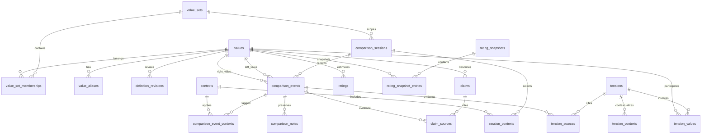

# Values Tool

Values Tool is a local-first analytical application for ranking personal values through adaptive pairwise comparisons. It uses a two-player TrueSkill-style Bayesian model, retains uncertainty instead of forcing a total order, and preserves the user's original reasoning as evidence.

The application has two delivery adapters:

- **GitHub Pages / static:** React + SQLite WASM (`sql.js`) + Drizzle, persisted as database bytes in IndexedDB. This is the canonical hosted experience and needs no server.
- **Local Node:** Next.js App Router + `better-sqlite3` + Drizzle. This provides server actions and a file-backed `data/values.db`.

Both adapters share the schema, rating engine, adaptive selector, convergence diagnostics, tension detection, imports, and tests. No authentication, secrets, cloud database, or external API is required.

## Quick Start

Requirements: Node.js 22 or newer and npm.

```bash
npm install
npm run dev:pages
```

Open `http://localhost:5173`. The browser app is closest to the GitHub Pages deployment.

For the file-backed Next.js adapter:

```bash
npm run db:migrate
npm run dev
```

Open `http://localhost:3000`.

Development seed data is deliberately separate from normal application data:

```bash
DATABASE_URL=./data/development.db npm run db:seed
DATABASE_URL=./data/development.db npm run dev
```

The seed command refuses to add demonstration records to a database that already contains a value set.

## Commands

```bash
npm run dev             # Next.js local server
npm run dev:pages       # Static browser/Pages application
npm run db:migrate      # Apply Drizzle migrations
npm run db:generate     # Generate a migration after schema changes
npm run db:seed         # Add development-only demonstration data
npm run lint            # ESLint
npm run typecheck       # Strict TypeScript
npm test                # Vitest unit and integration tests
npm run test:e2e        # Playwright desktop and mobile journeys
npm run build           # Next.js production build
npm run build:pages     # Static GitHub Pages build in out/
npm start               # Run a completed Next.js build
```

Install Playwright's browser once before running end-to-end tests:

```bash
npx playwright install chromium
```

## GitHub Pages

`.github/workflows/pages.yml` builds and deploys `out/` on every push to `main`. The Vite base path is set to `/values-tool/` in GitHub Actions, and the SQLite WASM binary is bundled with the artifact.

In the repository's GitHub settings, set **Pages > Build and deployment > Source** to **GitHub Actions**. The workflow runs unit/integration tests before deployment.

Browser data remains on the device in IndexedDB. Ranking results can be shared with the **Share results** button. The generated URL contains a read-only statistical snapshot (value names, means, uncertainty, evidence counts, scope, and timestamp); it intentionally excludes comparison notes and the rest of the database.

## Rating Model

Each value has `mu`, `sigma`, comparisons, wins, losses, ties, incomparable count, and last comparison time. The adapter in `src/domain/rating.ts` implements the standard two-player TrueSkill Gaussian update:

- Wins and losses move posterior means apart and reduce uncertainty.
- Draws use the configured draw margin and reduce uncertainty without inventing a winner.
- Incomparable, skip, and malformed outcomes do not update `mu` or `sigma` and are not draws.
- `tau` adds bounded dynamics before ranked updates.
- Conservative rank is `mu - k * sigma`.

Strength and confidence are always recorded. Their effect is disabled by default. If enabled, transparent factors multiply performance variance and are clamped to `[0.85, 1.15]`; no hidden score is used. Changing rating settings deterministically replays the effective append-only event stream.

Corrections append a new event with `supersedes_event_id`. Replay excludes superseded events but export and history retain both records.

## Context Ratings

Three explicit scopes are maintained:

- `global`: all effective ranked comparisons.
- `context:<id>`: only comparisons tagged with that context, starting at configured priors.
- `combined:<id>`: unscoped evidence plus evidence tagged with that context.

The ranking UI always labels the scope. Context-only results with sparse evidence remain visibly uncertain.

## Adaptive Selection

`src/domain/matchmaking.ts` scores every eligible pair using configurable, inspectable components:

- posterior uncertainty and similar strength;
- top-k and top-k-boundary relevance;
- minimum coverage;
- retest age;
- cross-category coverage;
- observed contradiction and context disagreement;
- a penalty for likely synonyms, strengthened after malformed comparisons.

The immediately previous pair is excluded. Ties are broken deterministically, while left/right presentation is deterministically balanced from a session seed. The queue exposes its primary reason and supports manual pairs, reordering, and regeneration.

## Convergence

Convergence is not a single percentage. `src/domain/convergence.ts` reports average and maximum uncertainty, top-k membership stability, recent Spearman correlation, adjacent-order probability, sparse values, near-ties, suspected contradictions, retest consistency, category coverage, and context instability.

The explanation distinguishes exact-order stability, top-k stability, stable tiers, unresolved contexts, and the need for more comparisons.

## Import and Export

Value-set JSON is documented in [`docs/example-value-set.json`](docs/example-value-set.json). CSV is documented in [`docs/example-values.csv`](docs/example-values.csv). Only `name` is required for CSV; aliases and tags use `|` separators. Imports are parsed with Zod and Papa Parse.

Complete JSON backups contain application/schema versions and all domain tables. Restore validates the envelope and performs replacements in one foreign-key-aware transaction. The browser and Node adapters use the same backup keys.

Normalized CSV downloads include:

```text
values.csv                 comparisons.csv
contexts.csv               sessions.csv
ratings.csv                rating_snapshots.csv
claims.csv                 claim_sources.csv
tensions.csv               tension_sources.csv
```

Reports export as Markdown or printable HTML and label statistical inference, source statements, rule-based aggregation, manual interpretation, and draft synthesis.

## Presets

Preset catalogs are ordinary JSON files in `data/presets/`. Each contains a slug, name, description, citation, redistribution note, taxonomy, and values. Add a file matching that shape; both adapters discover or bundle it without changes to rating logic.

Bundled catalogs contain short original paraphrases and bibliographic metadata, not proprietary questionnaire prompts or scoring materials.

## Data Model

All user-domain entities use UUIDs. Meaning-bearing comparisons are append-only. Multi-record writes use SQLite transactions, foreign keys are enabled, and derived ratings can be rebuilt from events.



Additional tables cover presets, application settings, adaptive queues, manual tiers, and cross-entity audit events. See `src/db/schema.ts` and `drizzle/0000_optimal_thing.sql`.

## Extension Points

### Replace the rating algorithm

Implement the `RatingSystem` interface in `src/domain/rating.ts`, keep outcome semantics explicit, and update replay to instantiate the new adapter. Add deterministic replay, draw, context, and supersession tests before changing the stored algorithm identifier or schema version.

### Add AI synthesis

Implement `SynthesisProvider` from `src/domain/synthesis.ts` in an optional adapter. The core uses `NoSynthesisProvider`, so it remains offline. Provider output must return `creationMethod: "ai"`, `status: "draft"`, original evidence text, and event IDs. Only an explicit user action may accept the resulting claim.

## Architecture Decisions

- **Static hosting:** GitHub Pages cannot run Next server actions or native SQLite. The Pages adapter uses bundled SQLite WASM and IndexedDB while retaining Drizzle and the same migration.
- **Event sourcing:** comparisons are immutable source records; ratings, snapshots, and suggestions are derived or reproducible.
- **Uncertainty:** seeded Monte Carlo sampling computes reproducible rank intervals and top-k probabilities.
- **Synthesis:** repeated tags, contexts, outcomes, and reversal notes are aggregated without rewriting original statements.
- **Auditability:** definitions, claims, tensions, and corrections retain revisions, status, provenance, and identifiers.
- **Privacy:** result-sharing URLs contain only the ranking snapshot, never private reasoning or complete backups.
